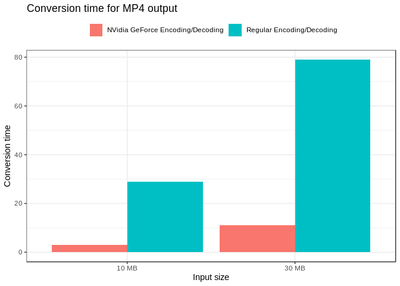
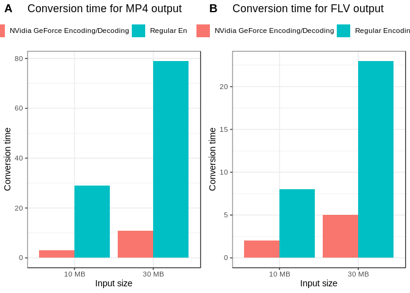
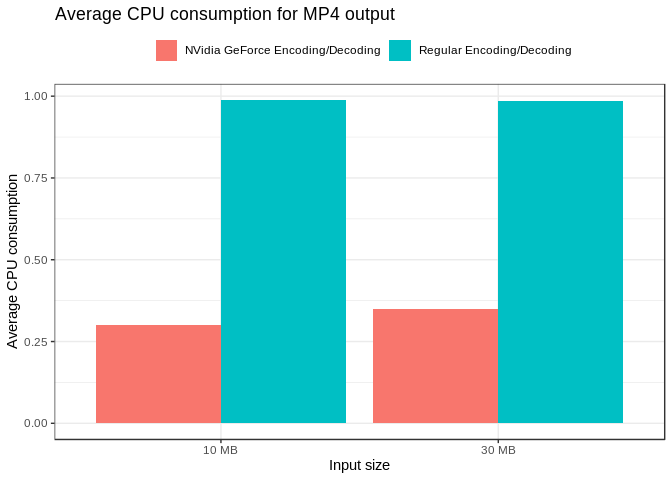
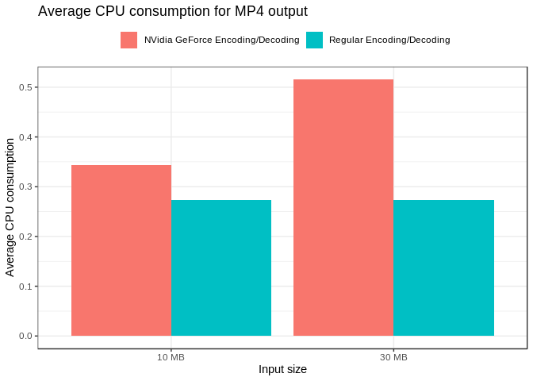
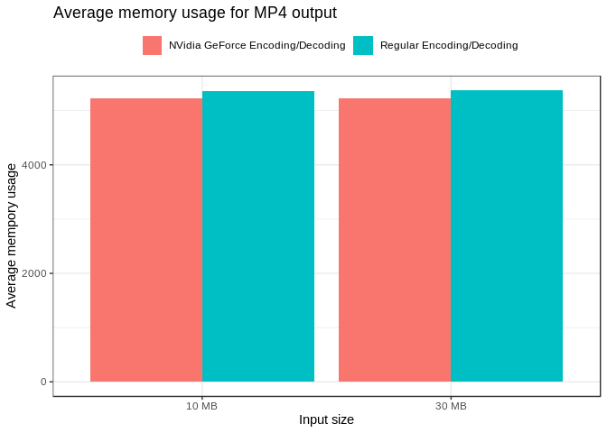
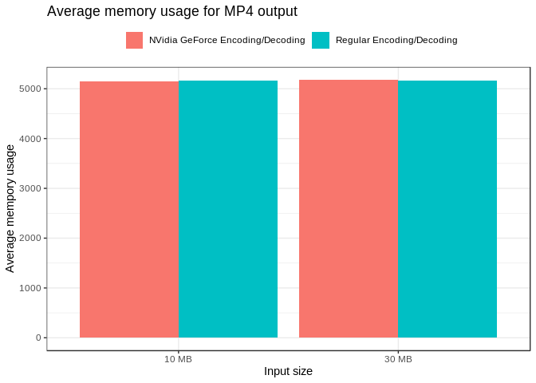

ADSD Experimentos
================
Gabriel Vinha
7/1/2019

``` r
library(tidyverse)
```

    ## ── Attaching packages ────────────────────────────────────────────────────────────────────────────────────────────────────────── tidyverse 1.2.1 ──

    ## ✔ ggplot2 3.2.0     ✔ purrr   0.3.2
    ## ✔ tibble  2.1.3     ✔ dplyr   0.8.2
    ## ✔ tidyr   0.8.3     ✔ stringr 1.4.0
    ## ✔ readr   1.3.1     ✔ forcats 0.4.0

    ## ── Conflicts ───────────────────────────────────────────────────────────────────────────────────────────────────────────── tidyverse_conflicts() ──
    ## ✖ dplyr::filter() masks stats::filter()
    ## ✖ dplyr::lag()    masks stats::lag()

``` r
library(knitr)
library(here)
```

    ## here() starts at /home/vinha/workspace/adsd-experiments

``` r
library(ggplot2)
library(cowplot)
```

    ## 
    ## Attaching package: 'cowplot'

    ## The following object is masked from 'package:ggplot2':
    ## 
    ##     ggsave

``` r
theme_set(theme_bw())
```

``` r
df <- read_csv("results/2/raw-convert.csv")
```

    ## Parsed with column specification:
    ## cols(
    ##   output = col_character(),
    ##   size = col_double(),
    ##   acc = col_logical(),
    ##   seconds = col_double(),
    ##   cpu = col_double(),
    ##   mem = col_double()
    ## )

``` r
df$acc[df$acc == FALSE] <- "Regular Encoding/Decoding"
df$acc[df$acc == TRUE] <- "NVidia GeForce Encoding/Decoding"
df$size[df$size == 10] <- "10 MB"
df$size[df$size == 30] <- "30 MB"
```

``` r
mp4Time <- subset(df, output == 'mp4') %>%
  ggplot(aes(x = size, y = seconds, fill=acc)) +
  geom_bar(stat='identity', position='dodge') +
  theme_bw() +
  scale_colour_brewer(palette="Set1") +
  theme(legend.title=element_blank(), legend.position="top") +
  xlab("Input size") +
  ylab("Conversion time") +
  ggtitle("Conversion time for MP4 output")  
```

``` r
flvTime <- subset(df, output == 'flv') %>%
  ggplot(aes(x = size, y = seconds, fill=acc)) +
  geom_bar(stat='identity', position='dodge') +
  theme_bw() +
  scale_colour_brewer(palette="Set1") +
  theme(legend.title=element_blank(), legend.position="top") +
  xlab("Input size") +
  ylab("Conversion time") +
  ggtitle("Conversion time for FLV output")
```

## O uso dos drivers e do acelerador Nvidia acelera o tempo de conversão?

Vemos que sim, com valores muito significativos:

### Conversão para MP4

``` r
mp4Time
```

<!-- -->

No primeiro caso (mp4) o tempo de conversão para arquivos de 10MB foi de
menos de 5 segundos para a conversão com acelerador e de aproximadamente
30 segundos para sem acelerador. Já para arquivos maiores (30MB): com
acelerador a média foi de 10 segundos e aproximadamente 80 sem.

### Conversão para FLV

``` r
flvTime
```

<!-- -->

No segundo caso (flv) o tempo de conversão para arquivos de 10MB foi de
menos de 2.5 segundos para a conversão com acelerador e de
aproximadamente 8 segundos para sem acelerador. Já para arquivos maiores
(30MB): com acelerador a média foi de 5 segundos e aproximadamente 25
sem.

## O tipo de arquivo modifica o tempo de conversão?

``` r
plot_grid(mp4Time, flvTime, labels="AUTO")
```

<!-- -->

Ao colocar os gráficos mostrados lado a lado vemos que as escala mudam,
assim conversões para flv são mais rápidas o que mostra que o software
faz bom uso de cache para conversões similares: FLV - FLV é mais
eficiente do que MP4 - FLV.

## O consumo de CPU é afetado?

``` r
cpuMp4 <- subset(df, output == 'mp4') %>%
  ggplot(aes(x = size, y = cpu, fill=acc)) +
  geom_bar(stat='identity', position='dodge') +
  theme_bw() +
  scale_colour_brewer(palette="Set1") +
  theme(legend.title=element_blank(), legend.position="top") +
  xlab("Input size") +
  ylab("Average CPU consumption") +
  ggtitle("Average CPU consumption for MP4 output")
```

``` r
cpuflv <- subset(df, output == 'flv') %>%
  ggplot(aes(x = size, y = cpu, fill=acc)) +
  geom_bar(stat='identity', position='dodge') +
  theme_bw() +
  scale_colour_brewer(palette="Set1") +
  theme(legend.title=element_blank(), legend.position="top") +
  xlab("Input size") +
  ylab("Average CPU consumption") +
  ggtitle("Average CPU consumption for MP4 output")
```

### Para MP4

``` r
cpuMp4
```

<!-- -->

Vemos que o consumo médio de CPU permanece aproximadamente o mesmo para
tamanhos de entrada variados pois esse valor é proporcional ao tempo de
coneversão (média de consumo durante a conversão). Vemos que quando o
driver não está presente o software utiliza de toda a cpu disponível,
sendo mais eficiente com o driver.

### Para FLV

``` r
cpuflv
```

<!-- -->

Neste caso vemos um comportamento distinto: conversões de mesmo tipo
são, na verdade, menos intensos em uspo de CPU quando não utilizamos o
driver Nvidia. Isso ocorre porque o processamento que é feito ocorre
para aúdio com mais intensidade (dado que os tipos são os mesmos e
muitas conersões de taxas de frames, por exemplo, não ocorrem). Portanto
o consumo foi similar para ambos os tamanhos e nenhum dos casos utilizou
mais do que 50% da cpu.

## O uso de memória é diferente?

``` r
memMp4 <- subset(df, output == 'mp4') %>%
  ggplot(aes(x = size, y = mem, fill=acc)) +
  geom_bar(stat='identity', position='dodge') +
  theme_bw() +
  scale_colour_brewer(palette="Set1") +
  theme(legend.title=element_blank(), legend.position="top") +
  xlab("Input size") +
  ylab("Average mempory usage") +
  ggtitle("Average memory usage for MP4 output")
```

``` r
memflv <- subset(df, output == 'flv') %>%
  ggplot(aes(x = size, y = mem, fill=acc)) +
  geom_bar(stat='identity', position='dodge') +
  theme_bw() +
  scale_colour_brewer(palette="Set1") +
  theme(legend.title=element_blank(), legend.position="top") +
  xlab("Input size") +
  ylab("Average mempory usage") +
  ggtitle("Average memory usage for MP4 output")
```

## Para MP4

``` r
memMp4
```

<!-- -->

``` r
memflv
```

<!-- -->

Para ambos vemos que o uso de memória (mostrado em MB) foi similar com e
sem o acelerador. Vemos uma leve diferentça nas escalas ao comparar os
tipos de saída, para MP4 ficou entre 4500MB e para FLV entre 5000MB.
