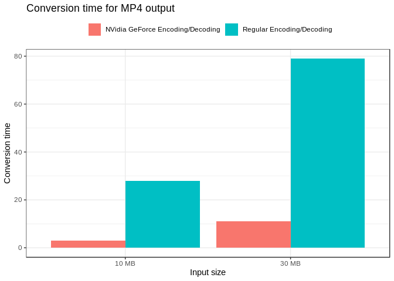
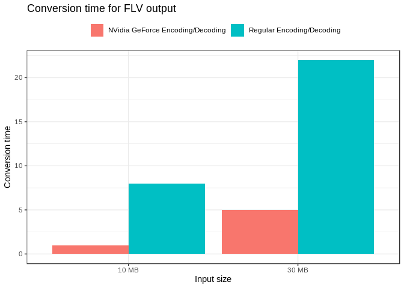

plot
================
Gabriel Vinha
7/1/2019

``` r
library(tidyverse)
```

    ## ── Attaching packages ───────────────────────────────────────────────────────────────────────────────────────────────────────── tidyverse 1.2.1 ──

    ## ✔ ggplot2 3.2.0     ✔ purrr   0.3.2
    ## ✔ tibble  2.1.3     ✔ dplyr   0.8.2
    ## ✔ tidyr   0.8.3     ✔ stringr 1.4.0
    ## ✔ readr   1.3.1     ✔ forcats 0.4.0

    ## ── Conflicts ──────────────────────────────────────────────────────────────────────────────────────────────────────────── tidyverse_conflicts() ──
    ## ✖ dplyr::filter() masks stats::filter()
    ## ✖ dplyr::lag()    masks stats::lag()

``` r
library(knitr)
library(here)
```

    ## here() starts at /home/vinha/workspace/adsd-experiments

``` r
library(ggplot2)
theme_set(theme_bw())
```

``` r
df <- read_csv("results/2/raw-convert.csv")
```

    ## Parsed with column specification:
    ## cols(
    ##   output = col_character(),
    ##   size = col_double(),
    ##   acc = col_logical(),
    ##   seconds = col_double()
    ## )

``` r
df$acc[df$acc == FALSE] <- "Regular Encoding/Decoding"
df$acc[df$acc == TRUE] <- "NVidia GeForce Encoding/Decoding"
df$size[df$size == 10] <- "10 MB"
df$size[df$size == 30] <- "30 MB"
```

``` r
subset(df, output == 'mp4') %>%
  ggplot(aes(x = size, y = seconds, fill=acc)) +
  geom_bar(stat='identity', position='dodge') +
  theme_bw() +
  scale_colour_brewer(palette="Set1") +
  theme(legend.title=element_blank(), legend.position="top") +
  xlab("Input size") +
  ylab("Conversion time") +
  ggtitle("Conversion time for MP4 output")  
```

<!-- -->

``` r
subset(df, output == 'flv') %>%
  ggplot(aes(x = size, y = seconds, fill=acc)) +
  geom_bar(stat='identity', position='dodge') +
  theme_bw() +
  scale_colour_brewer(palette="Set1") +
  theme(legend.title=element_blank(), legend.position="top") +
  xlab("Input size") +
  ylab("Conversion time") +
  ggtitle("Conversion time for FLV output")
```

<!-- -->
